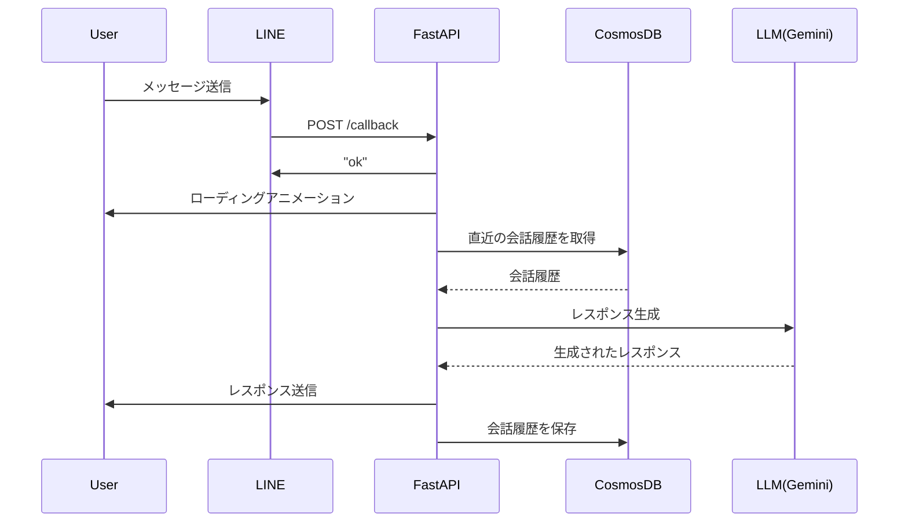

# LINE AI Agent

## プロジェクト概要

このプロジェクトは、LINE上でユーザーとAIアシスタントがチャットできるシステムを提供します。ユーザーからのメッセージに対して、AIアシスタントが適切な応答を生成し、LINEを通じてユーザーに返信します。

## 主な機能

- ユーザーからのLINEメッセージを受信し、AIアシスタントが応答を生成
- ローディングアニメーションの表示
- チャット履歴の保存と取得
- プロンプトテンプレートを使用したAIアシスタントの応答生成

## 使用技術

- Python 3.11
- FastAPI
- LINE Messaging API
- Langchain
- Azure Cosmos DB
- Docker
- GitHub Actions

## フォルダ構成

```
line-ai-agent/
├── .devcontainer/
├── .vscode/
├── api/
│ ├── main.py
│ ├── init.py
│ └── pycache/
├── docker-compose.yaml
├── Dockerfile
├── prompts/
│ └── system_prompt.txt
├── startup.txt
└── utils/
  ├── chat.py
  ├── common.py
  ├── config.py
  ├── cosmos.py
  └── init.py
```

## シーケンス図



## 前提条件

- LINE Messaging APIのチャンネルが作成されていること
- Langsmith, Anthropicでキーが発行されていること
- Azure App Service, Cosmos DBのリソースが作成されていること

## インストール方法

1. 必要なソフトウェア: Docker, Docker Compose
2. リポジトリをクローン: `git clone https://github.com/Tomodo1773/line-ai-agent`
3. プロジェクトディレクトリに移動: `cd line-ai-agent`
4. 環境変数ファイル(`.env`)を作成し、必要な情報を設定
5. Dockerコンテナをビルドして起動: `docker-compose up -d`
6. GitHub Actionsを使用してAzure App Serviceにデプロイ

## 使用方法

1. LINEアプリでAIアシスタントのLINE公式アカウントを友達追加
2. AIアシスタントにメッセージを送信
3. AIアシスタントから応答が返ってくる

## リファレンス

- [bicepリファレンス](https://learn.microsoft.com/en-us/azure/templates/microsoft.web/serverfarms?pivots=deployment-language-bicep#appserviceplanproperties)
-[Azure Developer CLI リファレンス](https://learn.microsoft.com/ja-jp/azure/developer/azure-developer-cli/reference#azd-hooks)

## ライセンス

このプロジェクトはMITライセンスの下で公開されています。
