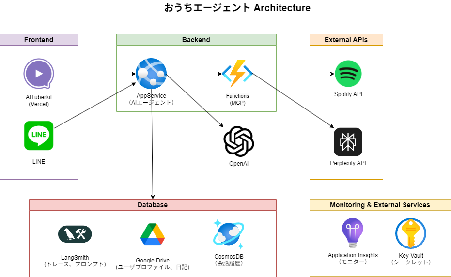
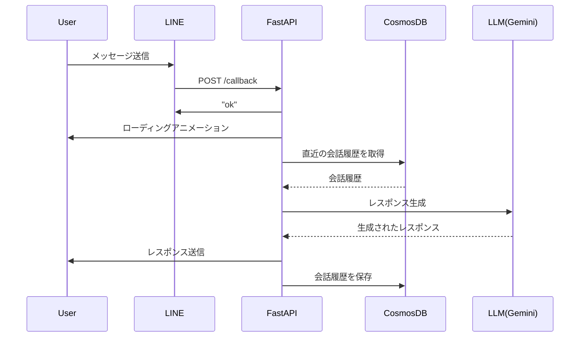
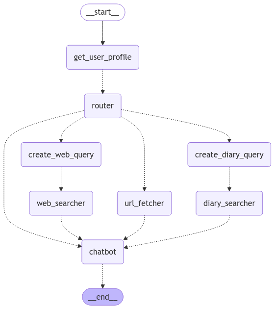

# LINE AI Bot

## プロジェクト概要

本プロジェクトはAzureのサービスとLINE Messaging APIを連携させて、ユーザーと自然な会話ができるキャラクターボットを構築するものです。ボットはAIエージェントとなっており、会話内容から検索が必要と判断した際はWeb検索をおこないます。

Azureの無料枠サービスを最大限に活用し、低コストで実現可能な構成を目指します。
デプロイにはAzure Developer CLI (azd) を用いてインフラプロビジョニングからアプリをデプロイまでを簡単なコマンドで提供します。

## 主な機能

- ユーザーからのLINEメッセージを受信し、LLMが応答を生成
- 幼馴染のお姉さん風のキャラクターで対応
- LLMがWeb検索が必要と判断した場合はWeb検索を実施
- 直近10件かつ過去1時間のチャット履歴を加味した応答を生成

## 構成図



## 技術スタック

- Python 3.11
- FastAPI
- LINE Messaging API
- Langchain
- LangGraph
- Tavily
- Azure AppService
- Azure Cosmos DB
- Docker
- Azure Developer CLI
- bicep

## シーケンス図



## AIエージェントグラフ



リクエストは最初にchatbotで処理されます。

1. Web検索が不要な場合はユーザへのレスポンスを生成し処理を終了します(__end__)
2. Web検索が必要な場合は`tools`ノードをcallします。
   1. `tools`にはWeb検索ツールとしてTavilyが設定されています。
   2. 検索が終了すると`chatbot`が再度callされます。
   3. `tools`の結果を踏まえて再度検索が必要かどうかを`chatbot`が判断します。

## 前提条件

- LINE Developersでチャンネルが作成されていること
- Langsmithでキーが発行されていること
- Azureサブスクリプションが作成されていること
- Google Ai StudioでGemini　APIキーが発行されていること

## インストール方法

GitHubから資材の取得

```powershell
git clone https://github.com/Tomodo1773/line-ai-agent.git
cd line-ai-agent
```

Azureログインと環境作成

```powershell
azd auth login
azd env new chatbot-demo
```

サンプルから`.env`のひな型を作成

```powershell
Get-Content .env.sample | Add-Content .azure/chatbot-demo/.env
```

`.azure/chatbot-demo/.env`を自分用の設定に書き換える

```env:.env
~Exsisting Settings~

# 必須項目
LINE_CHANNEL_ACCESS_TOKEN="YOUR_LINE_CHANNEL_ACCESS_TOKEN"
LINE_CHANNEL_SECRET="YOUR_LINE_CHANNEL_SECRET"
LANGCHAIN_API_KEY="YOUR_LANGCHAIN_API_KEY"
COSMOS_DB_DATABASE_NAME="YOUR_COSMOS_DB_DATABASE_NAME"
TAVILY_API_KEY="YOUR_TAVILY_API_KEY"
OPENAI_API_KEY="YOUR_OPENAI_API_KEY"
```

Azureへのプロビジョニング＆アプリデプロイ

```powershell
azd up
```

正常に終了すると構築されたAppServiceのURLが出力される

出力例


LINE Developersのチャンネル画面でwebhook URLを設定する。

LINE Developersのチャンネル画面>Messaging API設定>Webhook設定>Webhook URLで`出力されたURL + /callback`を設定する

設定例


## リファレンス

- [bicepリファレンス](https://learn.microsoft.com/en-us/azure/templates/microsoft.web/serverfarms?pivots=deployment-language-bicep#appserviceplanproperties)
- [Azure Developer CLI リファレンス](https://learn.microsoft.com/ja-jp/azure/developer/azure-developer-cli/reference#azd-hooks)
- [Azure Developer CLI デモモード](https://learn.microsoft.com/ja-jp/azure/developer/azure-developer-cli/manage-environment-variables#enable-demo-mode)

## ライセンス

このプロジェクトはMITライセンスの下で公開されています。
