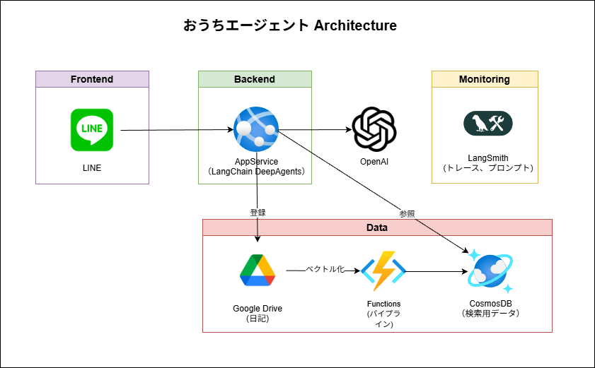

# LINE AIキャラクターエージェント

## プロジェクト概要

LINE上で動作するAIキャラクターエージェントシステムです。テキストで送った日記を管理し、パーソナライズされた会話を提供します。

> ⚠️ **アーキテクチャ刷新中**
> 現在 [ADR-0001](./docs/adr/0001-azure-native-agent-architecture.md) で定義した Azure ネイティブ構成（LINE ゲートウェイ + Microsoft Foundry ホステッドエージェント + Cosmos DB）へ移行中です。
> 進め方とフェーズごとの完了条件は [移行計画](./docs/migration-plan.md) を参照してください。
> 本 README は移行が進むにつれて更新されます。**この時点でアプリ全体は動作しません。**

### 利用者モデル

このアプリは現時点では `DIARY_USER_ID` で指定した1人だけが使う**個人専用**です。
LINE Gateway はそれ以外の送信者をキューへ入れず、Agent と Web UI は指定した所有者の
Cosmos DB パーティションだけを参照します。

Cosmos DB のユーザー別パーティションは将来の拡張用に維持しますが、複数ユーザー化には
認証済みアカウントと LINE アカウントの連携が必要です。利用者IDはリクエストから信用せず、
その連携情報を基にサーバー側で決定する設計へ変更してから提供します。

### 主要サービス構成

- **フロントエンド**
  - LINE Messaging API（メッセージング）

- **バックエンド**
  - Foundry ホステッドエージェント（`src/agent`）
  - Azure Functions（`src/func`。LINE ゲートウェイ／ワーカー）
  - 日記管理 Web UI（`src/webui`。Azure Container Apps Express）

- **データベース・ストレージ**
  - Azure Cosmos DB（日記エントリのベクトル検索、ユーザー情報）

- **監視・管理**
  - Application Insights（アプリケーション監視）
  - Azure Key Vault（シークレット管理）

## 構成図



※ 上図は刷新前の構成です。目指す最終形は ADR-0001 の構成図を参照してください。

## 主な機能

### 1. パーソナライズされた会話

- 幼馴染のお姉さん風キャラクターとしての応答

### 2. エージェント機能

- **Web検索**: OpenAI APIによる最新情報取得
- **日記検索**: ベクトル化による過去日記の検索・RAG機能

## 技術スタック

### フロントエンド

- LINE Messaging API

### バックエンド

- Python 3.11
- Microsoft Agent Framework（Foundry ホステッドエージェント）
- Azure Functions

### AI・検索

- OpenAI（Web検索含む）
- Azure Cosmos DB（ベクトル検索）

### Azure Services

- Azure Functions
- Azure Cosmos DB
- Azure Key Vault
- Application Insights

### 開発・デプロイ

- Docker（ストレージエミュレータ用）
- Azure Developer CLI（azd）
- Bicep（Infrastructure as Code）
- uv（パッケージ管理）
- sfw（Socket Firewall Free）

## 事前準備

### 必要なアカウント・リソース

- Azureサブスクリプション
- LINE Developersチャンネル
- OpenAI APIまたはAzure OpenAI

## インストール・デプロイ

> ⚠️ **注意**: アーキテクチャ刷新中のため、インストール・デプロイ手順は整備されていません。

### 開発者向け情報

開発に参加される方は、以下のドキュメントを参照してください：

- [CLAUDE.md](./CLAUDE.md) - 開発コマンドと環境構築
- [ADR-0001](./docs/adr/0001-azure-native-agent-architecture.md) - 目指す最終形
- [移行計画](./docs/migration-plan.md) - フェーズ分割と完了条件

## 開発環境のセットアップ

### ローカル開発環境

各サービス（agent、func）はローカルで直接起動します。ストレージエミュレータのみDocker Composeで実行します。

#### 1. ストレージエミュレータの起動

以下のサービスがDocker Composeで提供されます：

- **azurite**: Azure Storage エミュレータ（ポート 10000-10002）

**注**: CosmosDBはクラウド上の実際のCosmosDBインスタンスを使用します。エミュレータは削除されました。

```bash
# エミュレータを起動
docker compose up -d

# ログを確認
docker compose logs -f

# 停止
docker compose down
```

#### 2. 環境変数の設定

各サービスの `.env` ファイルを作成：

```bash
cp src/agent/.env.sample src/agent/.env
cp src/func/.env.sample src/func/.env
```

`.env` ファイルを編集して必要な環境変数を設定してください。

**ローカル開発時の注意点**:
- `src/func` は Cosmos DB・Storage・Foundry にマネージド ID で接続します。ローカルでは `az login` した
  ユーザーの権限が使われるため、接続文字列やアカウントキーの設定は不要です
- LINE のチャネルシークレットとアクセストークンだけは `.env` に設定してください

#### 3. 各サービスの起動

以下の「個別サービスの開発」セクションを参照して、各サービスをローカルで起動してください。

#### 接続情報

- Cosmos DB: クラウド上のCosmosDBインスタンス（環境変数で設定）
- Azurite Blob: http://localhost:10000
- Azurite Queue: http://localhost:10001
- Azurite Table: http://localhost:10002

### 個別サービスの開発

#### Agent Service（`src/agent/`）

Foundry ホステッドエージェント本体です。日記ツールとスキルを持ち、Responses プロトコルで応答します。

```bash
cd src/agent
sfw uv sync --locked         # lockfileを検証して依存関係をインストール
azd ai agent run             # ローカル起動（ポート 8088）
uv run --locked pytest       # テスト実行
uv run --locked ruff check   # リント
uv run --locked ruff format  # フォーマット
```

#### Function Service（`src/func/`）

```bash
cd src/func
sfw uv sync --locked         # lockfileを検証して依存関係をインストール
# Azure Functions Core Tools でローカル実行
```

#### Web UI Service（`src/webui/`）

日記の閲覧・日付変更・削除ができる管理画面です。作成と本文の編集は LINE 経由が本線のため持ちません。

```bash
cd src/webui
sfw uv sync --locked         # lockfileを検証して依存関係をインストール
cp .env.sample .env          # 環境変数を設定（ADMIN_USER / ADMIN_PASSWORD など）
az login                     # Cosmos DB へは自分の権限で接続する
uv run --locked uvicorn diary_admin.main:app --reload --env-file .env --port 8000
uv run --locked pytest       # テスト実行
uv run --locked ruff check . # リント
uv run --locked ruff format . # フォーマット
```

<http://localhost:8000> を開くと Basic 認証を求められます。`.env` に設定した `ADMIN_USER` / `ADMIN_PASSWORD` で入ってください。

## 日記 Web UI のデプロイ（Azure Container Apps Express）

[ADR-0001 §8](./docs/adr/0001-azure-native-agent-architecture.md) の通り、この UI だけは IaC の対象外とし、手順をここに残します。ACA Express はパブリックプレビューで仕様が動くため、Bicep に固定するより手順として書いておくほうが実態に合うという判断です。本体（LINE 経路）から独立しているので、止まってもサービスに影響はありません。

### 前提と制約（2026年7月時点）

- 対応リージョンは **West Central US と East Asia のみ**
- **シークレット管理・Key Vault 連携・マネージド ID・Easy Auth はいずれも未対応**（開発中）。そのため接続情報は環境変数に平文で載り、UI 自体の保護はアプリ側の Basic 認証で行う
- Microsoft Entra ID のアカウントが必要（個人の Microsoft アカウントでは使えない）
- HTTP のワークロードのみ。scale to zero に対応
- `containerapp` 拡張は 1.3.0b4 以降が必要

### 1. 権限を絞ったサービスプリンシパルを用意する

マネージド ID が使えないため資格情報を環境変数で渡すことになります。アカウントキーは日記以外にも届いてしまうので使わず、**日記コンテナだけに絞ったカスタムロール**を割り当てたサービスプリンシパルを使います。UI は日記の作成をしないので、作成・upsert の権限も渡しません（漏れても新規書き込みはできない状態にする）。

```bash
# UI 専用のサービスプリンシパルを作る（--role を指定しないので Azure ロールは付かない）
az ad sp create-for-rbac --name diary-webui
# 出力の appId / password / tenant を控える
```

`role-definition.json`:

```json
{
  "RoleName": "DiaryWebUi",
  "Type": "CustomRole",
  "AssignableScopes": ["/dbs/diary/colls/entries"],
  "Permissions": [
    {
      "DataActions": [
        "Microsoft.DocumentDB/databaseAccounts/readMetadata",
        "Microsoft.DocumentDB/databaseAccounts/sqlDatabases/containers/executeQuery",
        "Microsoft.DocumentDB/databaseAccounts/sqlDatabases/containers/items/read",
        "Microsoft.DocumentDB/databaseAccounts/sqlDatabases/containers/items/replace",
        "Microsoft.DocumentDB/databaseAccounts/sqlDatabases/containers/items/delete"
      ]
    }
  ]
}
```

```bash
az cosmosdb sql role definition create \
  --account-name <COSMOS_ACCOUNT> --resource-group <RESOURCE_GROUP> \
  --body @role-definition.json

# --principal-id はアプリ ID ではなくサービスプリンシパルのオブジェクト ID
az cosmosdb sql role assignment create \
  --account-name <COSMOS_ACCOUNT> --resource-group <RESOURCE_GROUP> \
  --role-definition-name DiaryWebUi \
  --principal-id "$(az ad sp show --id <APP_ID> --query id -o tsv)" \
  --scope /dbs/diary/colls/entries
```

### 2. イメージをビルドする

Express のイメージ取得はマネージド ID に未対応なので、匿名かトークン（ACR の管理者ユーザー）で引ける状態にします。`az acr build` を使えばローカルのアーキテクチャに関係なく linux/amd64 でビルドされます。

```bash
cd src/webui
az acr build --registry <ACR_NAME> --image diary-webui:latest --platform linux/amd64 .
```

### 3. Express 環境とアプリを作る

```bash
az extension add --name containerapp --upgrade

az containerapp env create \
  --environment-mode express \
  --name diary-webui-env \
  --resource-group <RESOURCE_GROUP> \
  --location westcentralus \
  --logs-destination none

az containerapp create \
  --name diary-webui \
  --resource-group <RESOURCE_GROUP> \
  --environment diary-webui-env \
  --image <ACR_NAME>.azurecr.io/diary-webui:latest \
  --target-port 8000 \
  --ingress external \
  --min-replicas 0 --max-replicas 1 \
  --registry-server <ACR_NAME>.azurecr.io \
  --registry-username <ACR_USERNAME> --registry-password <ACR_PASSWORD> \
  --env-vars \
    COSMOS_DB_ACCOUNT_URL=https://<COSMOS_ACCOUNT>.documents.azure.com:443/ \
    DIARY_USER_ID=<LINE_USER_ID> \
    ADMIN_USER=<BASIC_AUTH_USER> \
    ADMIN_PASSWORD=<BASIC_AUTH_PASSWORD> \
    AZURE_TENANT_ID=<TENANT> \
    AZURE_CLIENT_ID=<APP_ID> \
    AZURE_CLIENT_SECRET=<PASSWORD>
```

`ADMIN_PASSWORD` と `AZURE_CLIENT_SECRET` は `az containerapp show` で読める平文の環境変数です。手順1でスコープを日記コンテナに絞っているのはこのためです。Express がシークレット管理に対応したら移行してください。

### 4. 更新と確認

```bash
az acr build --registry <ACR_NAME> --image diary-webui:latest --platform linux/amd64 .
az containerapp update --name diary-webui --resource-group <RESOURCE_GROUP> \
  --image <ACR_NAME>.azurecr.io/diary-webui:latest

# 払い出された URL を確認する
az containerapp show --name diary-webui --resource-group <RESOURCE_GROUP> \
  --query properties.configuration.ingress.fqdn -o tsv
```

表示された URL をブラウザで開き、Basic 認証を通ると日記の一覧が出ます。

## プロジェクト構造

```text
line-character-agent/
├── src/
│   ├── agent/            # Foundry ホステッドエージェント（Microsoft Agent Framework）
│   │   ├── character_agent/  # エージェント定義・ツール・スキル
│   │   └── tests/        # テストコード
│   ├── func/             # Azure Functions（LINE ゲートウェイ／ワーカー）
│   └── webui/            # 日記管理 Web UI（FastAPI + Jinja2、ACA Express）
│       ├── diary_admin/  # アプリ本体・テンプレート
│       └── tests/        # テストコード
├── docs/                 # ADR・移行計画
├── infra/                # Bicep インフラコード
└── images/               # ドキュメント用画像
```

## データベース構成

### ストレージ構成

- **Cosmos DB**: 日記エントリのベクトル検索とユーザー情報管理に利用します。データベース名・コンテナ名はハードコーディングされており、環境変数での設定は不要です。

## データベーススキーマ

### Cosmos DB - 日記エントリ（diary/entries）

```json
{
  "id": "uuid",
  "userId": "string",          // パーティションキー
  "date": "2025-07-11",        // ISO形式日付
  "year": 2025,                // 年（数値）
  "month": 7,                  // 月（数値）
  "day": 11,                   // 日（数値）
  "dayOfWeek": 4,              // 曜日（0=月曜, 6=日曜）
  "content": "string",         // 日記本文
  "contentVector": [0.1, ...]  // 埋め込みベクトル
}
```

`tags` と `metadata.source` は Google Drive 同期時代の名残で、エージェントが作る日記には含まれません。

### Cosmos DB - ユーザー情報（main/users）

```json
{
  "id": "line-user-id",        // ユーザーID（パーティションキー）
  "userid": "line-user-id",    // LINEユーザーID
  "conversation_id": "conv_...", // Foundry の会話ID（Worker が管理）
  "profile": "# プロフィール\n...", // プロフィール（Markdown、read_profile が読む）
  "digest": {                  // 直近の出来事ダイジェスト
    "version": "2.0",
    "lastUpdated": "2026-07-28",
    "daily": [{ "date": "2026-07-27", "text": "家族と映画" }],
    "monthly": [{ "month": "2026-06", "summary": "...", "highlights": ["..."] }],
    "yearly": [{ "year": "2025", "summary": "...", "highlights": ["..."] }]
  }
}
```

プロフィールは1件だけなので、移行スクリプトは用意していません。Cosmos DB のデータエクスプローラーか
`az cosmosdb` で `users` ドキュメントに `profile` フィールドを足してください。

## リファレンス

- [Azure Developer CLI](https://learn.microsoft.com/ja-jp/azure/developer/azure-developer-cli/)
- [LINE Messaging API](https://developers.line.biz/ja/docs/messaging-api/)

## ライセンス

このプロジェクトはMITライセンスの下で公開されています。
