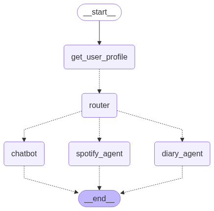

# LINE AIキャラクターエージェント

## プロジェクト概要

LINEとWebフロントエンドの両方に対応したAIキャラクターエージェントシステムです。ユーザーの音声日記を管理し、パーソナライズされた会話を提供します。LangGraphを活用したマルチエージェント構成により、日記管理、音楽再生、Web検索などの多様な機能を実現しています。

### 主要サービス構成

- **フロントエンド**
  - LINE Messaging API（メッセージング）

- **バックエンド**
  - LangGraph AIエージェントアプリ（Azure App Service）
  - MCPサーバー（Azure Functions）

- **データベース・ストレージ**
  - Azure Cosmos DB（会話履歴）
  - Google Drive（ユーザープロファイル、日記データ）

- **監視・管理**
  - Application Insights（アプリケーション監視）
  - Azure Key Vault（シークレット管理）
  - LangSmith（エージェントトレース・プロンプト管理）

## 構成図


## 主な機能

### 1. 音声日記機能

- LINEから音声メッセージを送信すると自動で日記として処理
- AI音声認識による文字起こし
- ユーザー辞書による誤字修正
- Markdown形式でGoogle Driveに自動保存
- AIエージェントからの感想コメント付きで返信
- 複数日の内容をまとめた日記ダイジェストの自動作成

### 2. マルチチャネル対応

- **LINE**: メッセージング・音声日記登録
- **OpenAI互換API**: 外部WebUIからの利用が可能

### 3. パーソナライズされた会話

- Google Driveに保存されたユーザープロファイルを参照
- 日記ダイジェストを活用した文脈理解
- 幼馴染のお姉さん風キャラクターとしての応答

### 4. 高度なエージェント機能

- **Spotify操作**: MCP経由での音楽再生・検索
- **Web検索**: Perplexity APIによる最新情報取得
- **日記検索**: ベクトル化による過去日記の検索（開発中）

## AIエージェントグラフ



### エージェント構成

1. **router**: ユーザーの発言内容から適切な処理にルーティング
2. **spotify_agent**: 音楽関連操作（MCPサーバー経由でSpotify API・Perplexity API利用）
3. **diary_search**: 日記内容のRAG検索（開発中）
4. **chatbot**: メイン会話処理（ユーザープロファイル・日記ダイジェスト参照、Web検索対応）

## 技術スタック

### フロントエンド

- LINE Messaging API
- OpenAI互換API（外部WebUI連携用）

### バックエンド

- Python 3.11
- FastAPI
- LangGraph（マルチエージェントオーケストレーション）
- LangChain
- Azure Functions（MCPサーバー）

### AI・検索

- OpenAI
- Perplexity API（Web検索）
- Azure Cosmos DB（ベクトル検索、開発中）

### 外部サービス連携

- Google Drive API（ファイル管理）
- Spotify Web API（音楽操作）
- Model Context Protocol（MCP）
- LangChain Hub（プロンプト管理）

### Azure Services

- Azure App Service
- Azure Functions
- Azure Cosmos DB
- Azure Key Vault
- Application Insights

### 開発・デプロイ

- Docker
- Azure Developer CLI（azd）
- Bicep（Infrastructure as Code）
- uv（パッケージ管理）

## システムフロー

### 音声日記登録フロー


### エージェント会話フロー


## 事前準備

### 必要なアカウント・リソース

- Azureサブスクリプション
- LINE Developersチャンネル
- Google Cloud Platform（Drive API有効化）
- OpenAI APIまたはAzure OpenAI
- Spotify Developerアカウント
- Perplexity API（オプション）
- LangSmithアカウント（オプション）

### Google Drive事前準備ファイル

以下のファイルをGoogle Driveに配置してください：

- `dictionary.md`: ユーザー辞書（音声認識の誤字修正用）
- `profile.md`: ユーザープロファイル（エージェントの応答パーソナライズ用）

## インストール・デプロイ

> ⚠️ **注意**: インストール・デプロイ手順は現在整備中です。  
> 現時点では本格的な運用に推奨できる状態ではありません。  
> 完全な手順書は後日公開予定です。

### 現在の状況

- Azure Bicepテンプレートによるインフラ自動構築
- 複数の外部サービス連携が必要（LINE、Google Drive、Spotify等）
- 環境変数の設定が複雑
- セットアップ手順の簡素化作業中

### 開発者向け情報

開発に参加される方は、以下のドキュメントを参照してください：

- [CLAUDE.md](./CLAUDE.md) - 開発コマンドと環境構築
- `src/api/README.md` - API Service詳細
- `src/mcp/README.md` - MCP Service詳細

## 開発コマンド

### API Service（`src/api/`）

```bash
cd src/api
uv sync                      # 依存関係インストール
uvicorn chatbot.main:app --reload  # ローカル実行
pytest                       # テスト実行
ruff check                   # リント
ruff format                  # フォーマット
```

### Function Service（`src/func/`）

```bash
cd src/func
uv sync                      # 依存関係インストール
# Azure Functions Core Tools でローカル実行
```

### MCP Service（`src/mcp/`）

```bash
cd src/mcp
uv sync                      # 依存関係インストール
```

## プロジェクト構造

```text
line-character-agent/
├── src/
│   ├── api/              # FastAPI アプリケーション
│   │   ├── chatbot/      # エージェント実装
│   │   └── tests/        # テストコード
│   ├── func/             # Azure Functions
│   └── mcp/              # MCP サーバー
├── infra/                # Bicep インフラコード
├── images/               # ドキュメント用画像
└── tools/                # 開発ツール
```

## 活用例

### 外部WebUIとの連携

本システムはOpenAI互換APIを提供しているため、以下のようなWebフロントエンドから利用できます：

- **AITuberkit**: キャラクター配信向けUI（VRMアバター対応）
- **Open WebUI**: 汎用的なチャットUI
- **その他OpenAI互換フロントエンド**: カスタムUI開発

## 開発中の機能

- **日記ベクトル化**: Cosmos DBを使用した日記内容のベクトル検索

## リファレンス

- [Azure Developer CLI](https://learn.microsoft.com/ja-jp/azure/developer/azure-developer-cli/)
- [LangGraph Documentation](https://langchain-ai.github.io/langgraph/)
- [Model Context Protocol](https://modelcontextprotocol.io/)
- [LINE Messaging API](https://developers.line.biz/ja/docs/messaging-api/)

## ライセンス

このプロジェクトはMITライセンスの下で公開されています。
