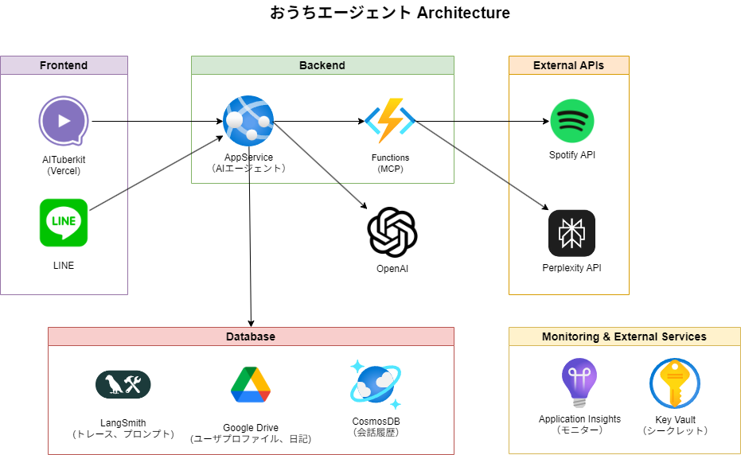

# LINE AIキャラクターエージェント

## プロジェクト概要

LINEとWebフロントエンドの両方に対応したAIキャラクターエージェントシステムです。ユーザーの音声日記を管理し、パーソナライズされた会話を提供します。LangGraphを活用したマルチエージェント構成により、日記管理、音楽再生、Web検索などの多様な機能を実現しています。

### 主要サービス構成

- **フロントエンド**
  - LINE Messaging API（メッセージング）

- **バックエンド**
  - LangGraph AIエージェントアプリ（Azure App Service）
  - 日記データアップロード機能（Azure Functions）
  - MCPサーバー（Azure Functions）

- **データベース・ストレージ**
  - PostgreSQL（LangGraph checkpointer による会話履歴管理）
  - Azure Cosmos DB（日記エントリのベクトル検索、ユーザー情報）
  - Google Drive（ユーザープロファイル、日記データ）

- **監視・管理**
  - Application Insights（アプリケーション監視）
  - Azure Key Vault（シークレット管理）
  - LangSmith（エージェントトレース・プロンプト管理）

## 構成図



## 主な機能

### 1. 音声日記機能

- LINEから音声メッセージを送信すると自動で日記として処理
- AI音声認識による文字起こし
- ユーザー辞書による誤字修正
- Markdown形式でGoogle Driveに自動保存
- AIエージェントからの感想コメント付きで返信（テキストメッセージ）
- 複数日の内容をまとめた日記ダイジェストの自動作成

### 2. マルチチャネル対応

- **LINE**: メッセージング・音声日記登録
- **OpenAI互換API**: 外部WebUIからの利用が可能

### 3. パーソナライズされた会話

- Google Driveに保存されたユーザープロファイルを参照
- 日記ダイジェストを活用した文脈理解
- 幼馴染のお姉さん風キャラクターとしての応答

### 4. 高度なエージェント機能

- **Spotify操作**: MCP経由での音楽再生・検索
- **Web検索**: OpenAI APIによる最新情報取得
- **日記検索**: ベクトル化による過去日記の検索・RAG機能

## AIエージェントグラフ


### エージェント構成

1. **router**: ユーザーの発言内容から適切な処理にルーティング
2. **spotify_agent**: 音楽関連操作（MCPサーバー経由でSpotify API・OpenAI API利用）
3. **diary_search**: 日記内容のRAG検索・ベクトル化による過去日記検索
4. **chatbot**: メイン会話処理（ユーザープロファイル・日記ダイジェスト参照、Web検索対応）

## 技術スタック

### フロントエンド

- LINE Messaging API
- OpenAI互換API（外部WebUI連携用）

### バックエンド

- Python 3.11
- FastAPI
- LangGraph（マルチエージェントオーケストレーション）
- LangChain
- Azure Functions（日記アップロード、MCPサーバー）

### AI・検索

- OpenAI（Web検索含む）
- Azure Cosmos DB（ベクトル検索）

### 外部サービス連携

- Google Drive API（ファイル管理）
- Spotify Web API（音楽操作）
- Model Context Protocol（MCP）
- LangChain Hub（プロンプト管理）

### Azure Services

- Azure App Service
- Azure Functions
- Azure Cosmos DB
- Azure Key Vault
- Application Insights

### 開発・デプロイ

- Docker
- Azure Developer CLI（azd）
- Bicep（Infrastructure as Code）
- uv（パッケージ管理）

## システムフロー

### 音声日記登録フロー


### エージェント会話フロー


## 事前準備

### 必要なアカウント・リソース

- Azureサブスクリプション
- LINE Developersチャンネル
- Google Cloud Platform（Drive API有効化）
- OpenAI APIまたはAzure OpenAI
- Spotify Developerアカウント
- LangSmithアカウント（オプション）

### Google Drive事前準備ファイル

以下のファイルをGoogle Driveに配置してください：

- `dictionary.md`: ユーザー辞書（音声認識の誤字修正用）
- `profile.md`: ユーザープロファイル（エージェントの応答パーソナライズ用）

## インストール・デプロイ

> ⚠️ **注意**: インストール・デプロイ手順は現在整備中です。  
> 現時点では本格的な運用に推奨できる状態ではありません。  
> 完全な手順書は後日公開予定です。

### 現在の状況

- Azure Bicepテンプレートによるインフラ自動構築
- 複数の外部サービス連携が必要（LINE、Google Drive、Spotify等）
- 環境変数の設定が複雑
- セットアップ手順の簡素化作業中

### 開発者向け情報

開発に参加される方は、以下のドキュメントを参照してください：

- [CLAUDE.md](./CLAUDE.md) - 開発コマンドと環境構築
- `src/api/README.md` - API Service詳細
- `src/mcp/README.md` - MCP Service詳細

## 開発コマンド

### API Service（`src/api/`）

```bash
cd src/api
uv sync                      # 依存関係インストール
uvicorn chatbot.main:app --reload  # ローカル実行
pytest                       # テスト実行
ruff check                   # リント
ruff format                  # フォーマット
```

### Function Service（`src/func/`）

```bash
cd src/func
uv sync                      # 依存関係インストール
# Azure Functions Core Tools でローカル実行
```

### MCP Service（`src/mcp/`）

```bash
cd src/mcp
uv sync                      # 依存関係インストール
```

## プロジェクト構造

```text
line-character-agent/
├── src/
│   ├── api/              # FastAPI アプリケーション（LINE webhook、チャットボット）
│   │   ├── chatbot/      # エージェント実装
│   │   └── tests/        # テストコード
│   ├── func/             # Azure Functions（日記データのCosmosDBアップロード）
│   └── mcp/              # MCP サーバー（Spotify連携）
├── infra/                # Bicep インフラコード
├── images/               # ドキュメント用画像
└── tools/                # 開発ツール
```

## 活用例

### 外部WebUIとの連携

本システムはOpenAI互換APIを提供しているため、以下のようなWebフロントエンドから利用できます：

- **AITuberkit**: キャラクター配信向けUI（VRMアバター対応）
- **Open WebUI**: 汎用的なチャットUI
- **その他OpenAI互換フロントエンド**: カスタムUI開発

## データベース構成

### ストレージ構成

- **PostgreSQL**: LangGraph の PostgreSQL checkpointer が会話スレッド（メッセージ履歴、ステート）を自動管理します。テーブルはライブラリ側で自動作成され、環境変数 `POSTGRES_CHECKPOINT_URL` で接続文字列を指定します。
- **Cosmos DB**: 日記エントリのベクトル検索とユーザー情報管理に利用します。データベース名・コンテナ名はハードコーディングされており、環境変数での設定は不要です。

## データベーススキーマ

### Cosmos DB - 日記エントリ（diary/entries）

```json
{
  "id": "uuid",
  "userId": "string",          // パーティションキー
  "date": "2025-07-11",        // ISO形式日付
  "year": 2025,                // 年（数値）
  "month": 7,                  // 月（数値）
  "day": 11,                   // 日（数値）
  "dayOfWeek": 4,              // 曜日（0=月曜, 6=日曜）
  "content": "string",         // 日記本文
  "contentVector": [0.1, ...], // 埋め込みベクトル
  "tags": [],                  // タグ配列
  "metadata": {
    "source": "2025年07月11日(金).md"
  }
}
```

### Cosmos DB - ユーザー情報（main/users）

```json
{
  "id": "line-user-id",        // ユーザーID（パーティションキー）
  "date": "2025-07-13T15:30:00+09:00", // 作成・更新日時（ISO形式）
  "userid": "line-user-id",    // LINEユーザーID
  "google_tokens_enc": "暗号化された文字列", // Google OAuth認証トークン（暗号化済み）
  "drive_folder_id": "1AbCdEfGhIjKlMnOp" // Google Driveの保存先フォルダID
}
```

> **注意**: `google_tokens_enc`はGoogle DriveのOAuth認証トークンを暗号化して保存しています。トークンには`token`、`refresh_token`、`token_uri`、`expiry`が含まれます。

## リファレンス

- [Azure Developer CLI](https://learn.microsoft.com/ja-jp/azure/developer/azure-developer-cli/)
- [LangGraph Documentation](https://langchain-ai.github.io/langgraph/)
- [Model Context Protocol](https://modelcontextprotocol.io/)
- [LINE Messaging API](https://developers.line.biz/ja/docs/messaging-api/)

## ライセンス

このプロジェクトはMITライセンスの下で公開されています。
