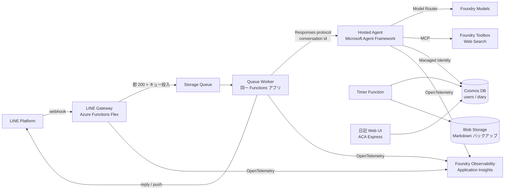

# ADR-0001: Azure ネイティブなエージェント基盤への刷新

- ステータス: Proposed
- 日付: 2026-07-28

## サマリ

App Service 上の LangGraph アプリという現構成を捨て、**LINE ゲートウェイ（Azure Functions）+ Microsoft Foundry ホステッドエージェント + Cosmos DB** を軸にした構成へ全面的に移行する。あわせて、音声文字起こし・Google Drive 連携・LangGraph チェックポインター・日記登録ワークフローを廃止し、**テキスト入力を単一のエージェントがツールとスキルでさばく**形に単純化する。

本 ADR は「目指す最終形」の定義のみを扱う。移行手順・作業分割は別途扱う。

## コンテキスト

### 運用上の問題

- App Service の Free (F1) SKU で運用していたが、アプリの肥大化により起動時間が伸び、最終的に起動しなくなった。実質的にサービス停止している。
- 低コスト（月1,000円程度まで）で運用を継続したい。常時起動インスタンスを前提にした構成は取りたくない。

### 設計上の問題

- **入力経路が二重化している**: 音声メッセージは `diary_workflow`（LangGraph の固定グラフ）、テキストメッセージは `character_graph`（Deep Agent）と、まったく別の処理系を通る。同じ「日記を書く」という行為が2系統に分かれている。
- **音声文字起こしの前提が変わった**: スマートフォン側で、ユーザー辞書に沿った文字起こしと整形が完結するようになった。アプリ側で文字起こしを担う必然性が失われた。
- **チェックポインターが過剰**: 会話履歴のために LangGraph の PostgreSQL チェックポインター（外部 Postgres サービス）を運用しており、接続プールのアイドル切断対策など、本質的でないコードと外部依存を抱えている。
- **Google Drive 連携が構成を複雑にしている**: 日記の保存先が Drive であるために、OAuth 認可フロー・トークン暗号化・state 管理・フォルダ ID 登録という一連の仕組みが必要になっている。日記の検索用データは結局 Cosmos DB にも入っており、実体が二重管理になっている。

### このリポジトリの位置づけ

本リポジトリは個人用エージェントを育てる場であると同時に、**Azure における AI アプリケーション構築のキャッチアップの場**でもある。2026年前半に Foundry Agent Service・Microsoft Agent Framework・Foundry Observability が相次いで GA したことで、「いま Azure で AI アプリを作るならこう組む」という形が定まった。この構成に乗ることを、刷新の評価軸のひとつとして明示的に扱う。

## 決定

### 全体構成

### 1. 実行基盤: ゲートウェイとエージェントの分離

LINE の webhook 受信とエージェント実行を、**キューを挟んで完全に非同期化**する。

1. **Gateway（Azure Functions / Flex Consumption）**: webhook を受信し、署名検証のうえ Storage Queue に投入して即座に 200 を返す。
2. **Queue Worker（同一 Functions アプリ）**: ローディングアニメーションを表示し、ホステッドエージェントの Responses エンドポイントを呼ぶ。
3. **返信**: reply token（受信から1分間有効）での応答を優先し、間に合わなかった場合のみ push にフォールバックする。LINE 公式アカウントのフリープランでは push が月200通に制限される一方、reply は無料かつ無制限であるため、push はフォールバック専用とする。

この分離により、**Functions とホステッドエージェントで2回コールドスタートが発生しても LINE のタイムアウトとは無関係になる**。エージェント側のコールドスタートはローディングアニメーションの表示中に吸収される。ホステッドエージェントのセッションは15分アイドルで停止するため、遅延が体感されるのは久しぶりの初回メッセージのみとなる。

副次的な効果として、現行の `BackgroundTasks` + `asyncio.run_coroutine_threadsafe` によるイベントループ共有（`src/api/chatbot/main.py`）が不要になる。

### 2. エージェント: Microsoft Agent Framework によるシングルエージェント

- エージェント本体は **Microsoft Agent Framework (MAF) 1.0** で実装し、コンテナとして Foundry ホステッドエージェントにデプロイする。
- 日記登録ワークフローのような固定グラフは持たない。**単一のエージェントがツールとスキルを使って再帰的に判断する**構成とする。「今から昨日の日記を書く」と宣言してから本文を送る、といった対話は、スキルに手順を記述してエージェントに判断させる。
- スキルは MAF の Agent Skills 機能を用いる。ディレクトリから `SKILL.md` を発見し、システムプロンプトに一覧を広告したうえで、`load_skill` / `read_skill_resource` / `run_skill_script` により必要時に読み込む（progressive disclosure）。現行の deepagents のスキル構成をほぼそのまま移植できる。
- ツールは日記操作の一式に整理する: `diary_create` / `diary_update` / `diary_delete` / `diary_rename` / `diary_search`（ベクトル検索）/ `digest_regenerate` / `read_profile`。
- Web 検索は Foundry Toolbox の Web Search を MCP 経由で利用する。ホステッドエージェントはエージェント定義への直接のツール追加をサポートしないため、Foundry 側のツールは Toolbox の MCP エンドポイント経由で接続する。
- モデルは **Model Router** を経由して呼び出し、リクエストの性質に応じた軽量モデル / 高性能モデルの選択をプラットフォームに委ねる。

### 3. 状態管理: 会話履歴はプラットフォーム、アプリデータは Cosmos DB

責務を明確に分離する。

| 対象 | 保存場所 | 備考 |
|------|----------|------|
| 会話履歴 | Foundry（Responses プロトコルの conversation） | プラットフォーム管理。アプリ側に実装なし |
| ユーザー情報・現在の conversation ID・プロフィール | Cosmos DB `users` | 現行の `session_id` を conversation ID に置き換える |
| 日記本文・埋め込みベクトル | Cosmos DB `diary/entries` | 現行スキーマを踏襲 |

**LangGraph / MAF のチェックポインターは使用しない。** Responses プロトコルでホストされたエージェントは、チェックポインターを持たない場合に過去のレスポンス履歴をランタイムから注入される。会話の継続はクライアント（Worker）が conversation ID を渡すことで成立するため、アプリ側で会話状態を永続化する必要がない。これに伴い外部 Postgres サービスは解約する。

「閑話休題」による履歴リセットは、新しい conversation を作成して `users` ドキュメントの conversation ID を差し替えるだけの処理となる。

Foundry Agent Service の **Standard セットアップ（BYO Thread Storage）は採用しない**（理由は「採用しなかった選択肢」を参照）。Basic セットアップを前提とする。

### 4. データ: Cosmos DB への一本化と Google Drive の廃止

- 日記の正は Cosmos DB とする。Google Drive への保存は廃止する。
- これに伴い、**Google OAuth 関連の仕組みを全廃する**: 認可フロー、トークン暗号化、`oauth_states` コンテナ、OAuth コールバックエンドポイント、フォルダ ID 登録の対話。ユーザーは友だち追加のみで利用開始できる状態になる。
- プロフィール（現 `profile.md`）は Cosmos DB に移す。ユーザー辞書（`dictionary.md`）は音声文字起こしの廃止に伴い不要となる。
- **バックアップ**: Timer Function により、日記コンテナの内容を日次で Markdown ファイルとして Blob Storage にエクスポートする。Cosmos DB の定期バックアップに加え、人間が直接読める形式の退避先を確保する。

### 5. 可観測性: Foundry Observability への統合

- トレースは **OpenTelemetry ベースの Foundry Observability** に統一し、LangSmith の利用を終了する。
- ホステッドエージェントには Application Insights の接続文字列が自動で注入され、プロトコルライブラリが既定で OTel トレース（モデル呼び出し、ツール実行、トークン使用量）を送出する。
- Gateway / Worker（Functions）側も同一の Application Insights に接続し、W3C Trace Context により **LINE 受信からツール実行までを1本の分散トレースとして追跡できる**状態にする。
- **Foundry Evaluations** を導入する。エージェント向け評価器（intent resolution / tool call accuracy / task adherence）により「日記登録の依頼に対して正しいツールを呼べているか」を評価し、本番トレースのサンプリングによる継続評価と、CI での小規模な評価セット実行を行う。

### 6. 認証: シークレットの最小化

- ホステッドエージェントに自動発行される **Entra Agent ID** を利用し、Cosmos DB へは RBAC（マネージド ID）で接続する。アカウントキーを廃止する。
- モデル呼び出しは Foundry プロジェクトエンドポイント経由の Entra 認証とし、`OPENAI_API_KEY` を廃止する。
- 結果として Key Vault で管理するシークレットは **LINE のチャネルシークレットとアクセストークンのみ**となる。

### 7. 日記 Web UI

日記の閲覧・リネーム・削除を行う小規模な管理 UI を用意し、**Azure Container Apps Express** にデプロイする。本体（LINE 経路）から独立しており停止しても影響がないため、プレビュー段階のサービスを試す場として適切と判断する。Express は現時点でシークレット管理が未対応のため、権限を絞った接続情報の利用と、UI 自体への簡易認証を必須とする。

### 8. IaC の方針

| 対象 | 管理方法 |
|------|----------|
| Foundry アカウント / プロジェクト / モデルデプロイ、Cosmos DB、Functions、Storage、Key Vault、Application Insights | Bicep |
| ホステッドエージェントのビルドとデプロイ | `azd` の AI agent 拡張（`azure.yaml`） |
| 日記 Web UI（ACA Express） | IaC 対象外。手順を README に記載 |

App Service および同 Free プランは削除する。

### 廃止するもの

| 廃止対象 | 理由 |
|----------|------|
| App Service + F1 プラン（`infra/app/api.bicep`） | ホステッドエージェント + Functions へ移行 |
| LangGraph PostgreSQL チェックポインターと外部 Postgres | Responses プロトコルの履歴管理へ移行 |
| Google Drive 連携一式（`google_auth.py` / `crypto.py` / `google_drive*.py` / `drive_folder.py` / OAuth コールバック / `oauth_states` コンテナ） | Cosmos DB へ一本化 |
| 日記登録ワークフロー（`agent/diary_workflow/`） | シングルエージェント + スキルへ統合 |
| 音声文字起こし（`utils/transcript.py`、音声メッセージハンドラ） | スマートフォン側へ移譲。音声受信時は案内を返すのみ |
| Drive から Cosmos DB への同期 Function | 同期元が消滅 |
| LangSmith 連携（`@traceable`、`LANGSMITH_API_KEY`） | Foundry Observability へ移行 |
| `docker-compose.yml` の postgres | チェックポインター廃止に伴い不要 |

## 採用しなかった選択肢

| 選択肢 | 不採用の理由 |
|--------|-------------|
| **Foundry Agent Service の Standard セットアップ（BYO Thread Storage）** | 会話履歴を自前の Cosmos DB に保持できるが、`enterprise_memory` データベースに専用コンテナを3つ作成し、それぞれ 1000 RU/s・合計 3000 RU/s を要求する。Cosmos DB 無料枠（1000 RU/s）では成立せず、データ主権要件を持たない個人アプリで採用する理由がない |
| **ACA Express を LINE 経路の本線に置く** | パブリックプレビューであり、対応リージョンが West Central US / East Asia のみ（日本リージョンなし）、シークレット管理・Key Vault 連携・課金体系が未整備。管理 UI の置き場としてのみ採用する |
| **LangGraph / deepagents の継続利用** | 技術的には成立し、ホステッドエージェントもフレームワーク非依存である。ただし Azure のキャッチアップという目的に対して MAF の方が適合する。今回必要なのはシングルエージェント + ツール + スキルのみであり、deepagents のプランニングやサブエージェントは過剰装備だった |
| **webhook を同期処理して直接エージェントを呼ぶ** | ゲートウェイとエージェントで2回のコールドスタートが直列し、reply token の1分制限を超えるリスクがある |
| **音声文字起こしの継続** | スマートフォン側で辞書適用込みの文字起こしが完結するようになり、アプリ側で担う価値がなくなった。入力経路を2系統に保つコストに見合わない |
| **Foundry IQ によるマネージド RAG** | Azure AI Search が前提でコストが跳ねる。日記のベクトル検索は Cosmos DB 無料枠で完結しているため現状維持とする。RAG を深掘りする際の将来テーマとして残す |
| **Voice Live / WebSocket プロトコル** | 音声入力を廃止する方針と整合しない |

## 結果

### 期待する効果

- **コード量が大幅に減る**: OAuth 一式、チェックポインター周辺、音声処理、固定ワークフローが消え、残るのは Gateway / Worker、エージェント、ツール群、バックアップのみとなる。
- **外部依存が減る**: Google Drive、外部 Postgres、LangSmith の3つの外部サービスから解放される。
- **入力経路が1本になる**: すべてテキストとしてエージェントに渡り、処理の分岐がエージェントの判断に集約される。
- **Azure の現行スタックを一通り実践できる**: MAF、ホステッドエージェント、Model Router、Toolbox、OTel 分散トレース、継続評価、キーレス認証。

### コスト（概算・月額）

| 項目 | 概算 |
|------|------|
| ホステッドエージェント（scale-to-zero、1日数時間の稼働想定） | 数百円程度 |
| Azure Functions（Flex Consumption） | 無料枠内 |
| Cosmos DB | 無料枠内 |
| Blob Storage / Queue | 数十円 |

合計で月1,000円前後を見込む。あわせて外部 Postgres と LangSmith の費用が不要になる。ホステッドエージェントは稼働セッション数と割り当てリソースに比例して課金されるため、サンドボックスサイズは実測に基づき最小構成から始める。

### リスクと許容範囲

- **ホステッドエージェントは新しいサービスであり仕様変更の可能性がある**。ただしフレームワーク非依存であるため、最悪の場合は同一コンテナを標準の Container Apps に載せ替えられる。その場合は会話履歴の管理のみ自前実装が必要になる。
- **会話セッションは30日間の非アクティブで削除される**。永続すべきデータをサンドボックスの `$HOME` に置かず、Cosmos DB に保持する設計を守ることで影響を受けない。
- **push メッセージの月200通制限**。reply 優先・push フォールバックの設計を維持する。バックアップ失敗通知などの能動的な通知もこの枠を消費する点に留意する。
- **ACA Express のプレビュー起因の不安定さ**。本体経路から切り離しているため、停止してもサービス影響はない。

### 実験枠として扱うもの

以下はプレビュー段階であり、本線とは切り離して並行検証する。

- **Foundry Agent Service の Memory（user / session / procedural）**: 現在プロフィールとダイジェストで手作りしている「ユーザーを記憶している状態」をプラットフォームに委ねられる可能性がある。プロフィールの Cosmos DB 移行を本線としたうえで、置き換え可能性を検証する。

## 参考

- [Hosted agents in Foundry Agent Service](https://learn.microsoft.com/en-us/azure/foundry/agents/concepts/hosted-agents)
- [Set up standard agent resources for Foundry Agent Service](https://learn.microsoft.com/en-us/azure/foundry/agents/concepts/standard-agent-setup)
- [Agent Skills（Microsoft Agent Framework）](https://learn.microsoft.com/en-us/agent-framework/agents/skills)
- [Observability in Generative AI](https://learn.microsoft.com/en-us/azure/foundry/concepts/observability)
- [Azure Container Apps Express Overview (preview)](https://learn.microsoft.com/en-us/azure/container-apps/express-overview)
- [Receive messages (webhook) - LINE Developers](https://developers.line.biz/en/docs/messaging-api/receiving-messages/)
