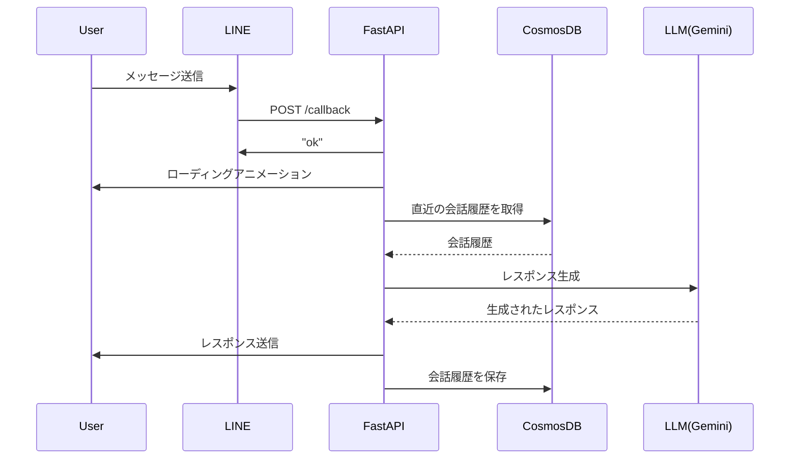

# mermeid

```mermaid
sequenceDiagram
    participant User as User
    participant LINE as LINE
    participant FastAPI as FastAPI
    participant CosmosDB as CosmosDB
    participant LLM as LLM(Gemini)

    User->>LINE: メッセージ送信
    LINE->>FastAPI: POST /callback
    FastAPI->>LINE: "ok"
    FastAPI->>User: ローディングアニメーション
    FastAPI->>CosmosDB: 直近の会話履歴を取得
    CosmosDB-->>FastAPI: 会話履歴
    FastAPI->>LLM: レスポンス生成
    LLM-->>FastAPI: 生成されたレスポンス
    FastAPI->>User: レスポンス送信
    FastAPI->>CosmosDB: 会話履歴を保存
```
